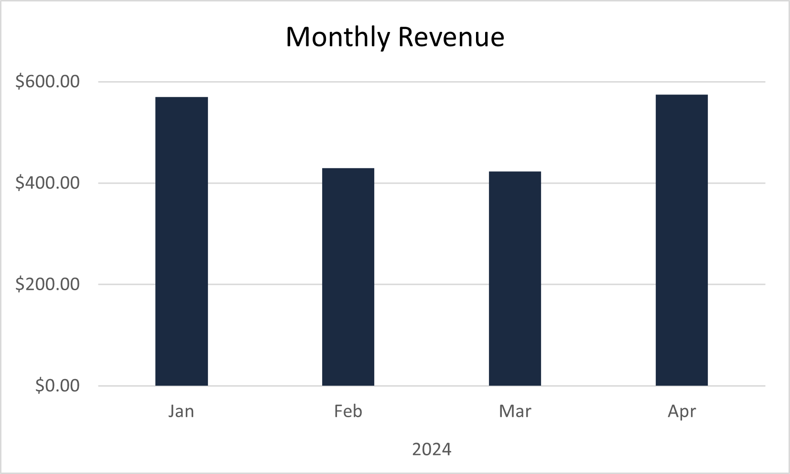
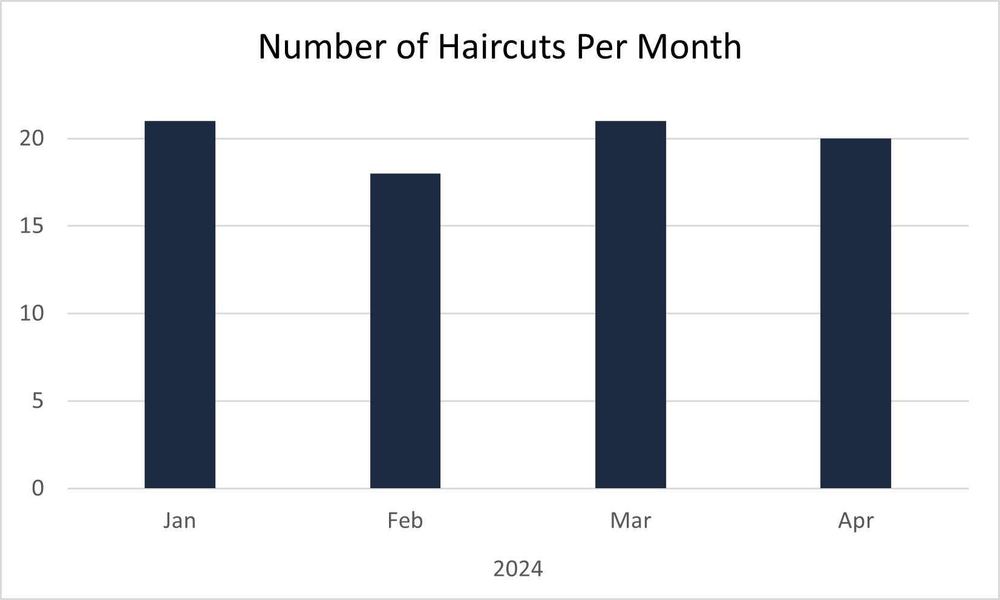
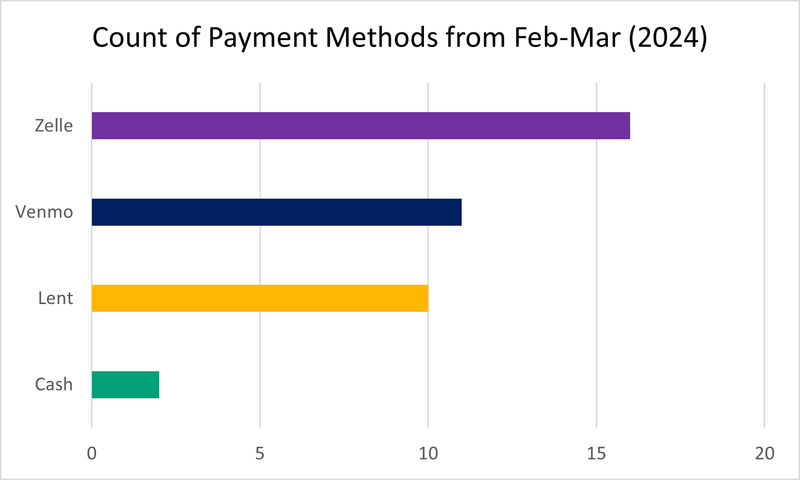
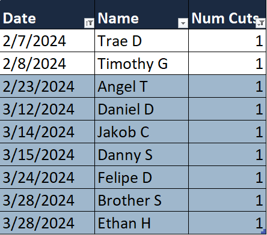
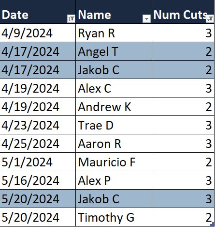

# Overview
This case study is a retrospective analysis that involves investigating past revenue trends to identify the cause of a drop and surface insights on customer behavior. The project utilizes a self-created dataset from my barbering side business which contains information such as appointment dates, client history, and payment amounts/methods.  

# Business Question
Why did revenue drop 24.6% in Febraury 2024 then increase 35.9% in April 2024?

*Fig 1: Bar graph showcasing the monthly revenue from January to April of 2024*

# The Analysis
Typically, months that have lower earnings can be attributed to reduced availability during extended periods of me being out of town. During these times, the number of appointments I am able to accomodate is much lower than normal. 

I used another chart to investigate the number of haircuts I did during that time to see if it would offer more insights towards the revenue drop.   

 
 *Fig 2: Bar graph comparing the number of haircuts per month from January to April of 2024*

Since the number of haircuts for the months in question remained relatively steady, I continued to explore deeper. After delving into my ledger, I realized that the time frame aligned with the Catholic season of Lent (Feb 14, 2024 - Mar 28, 2024). During this time, I offered "free" haircuts on Fridays with the optional offer for clients to donate whatever amount they would typically pay.

Payment amounts that went toward Lenten donations were not factored into the calculation of monthly revenue. *Figure 3* shows that 10 haircuts went towards donations, explaining the reason for the dip in revenue early in the year. 

*Fig 3: Bar graph comparing the count of different payment methods between February and March of 2024*

I was able to build a majority of my initial clientele in 2023 from doing something similar and so I wanted to explore whether new clients who scheduled during Lent in 2024 for a "free" haircut returned after the season ended.

# Exploratory Question
What was the conversion rate after the Lenten season had ended?

## Finding the Conversion Rate
### New Clients
To identify all new clients, I filtered the date range to only include dates between February and March 2024. Then, I filtered the data further to only show clients who only received 1 haircut up to that point. The last step was to only select those who scheduled within the Lenten season leaving me with 7 new clients.

   
*Fig 4: Table highlighting all new clients during Lent*
### Returning Clients
To find all returning clients, I created a duplicate sheet and adjusted the date range to include all haircuts from April and May 2024. Then, I filtered it further to only show those with 2 or 3 haircuts up to that point. Finally, I utilized an XLOOKUP function to return any names that showed up from the table of new clients (*Figure 4*). Unfortunately, this search only yielded a result of 2 clients that had returned.

   
*Table highlighting clients who returned after Lent*

### Final Calculation
$Conversion$ $Rate=$ ($Returning$ $Lenten$ $Clients$ $/$  $New$ $Lenten$ $Clients$) $ * 100$

$28.6\% = (2/7)*100$ 

# Conclusions
## Insights
While the goal of this period was not to run a customer acquisiton campaign, my analysis revealed that offering free haircuts once a week for a ~1.5 month period resulted in a **28.6%** conversion rate for new clients. It left me curious to see how much the business could grow if a more intentional acquisition strategy were implemented.

## Suggestions
### Investigate Limiting Factors
It appears that over the course of the entire analysis period, my business seemed to average around 20 haircuts per month (*Figure 2*). Is this trend consistent when looking at a larger timeframe? And if so, is this due to a limit on the number of appointments I had available (capacity constraint) or due to the size of my clientele (demand constraint)? 

To investigate the capacity constraint, more analysis would have to be done on the number of appointment timeslots that are available vs filled per month.  For the demand constraint, the total number of returning customers would have to be determined. It would also be helpful to compare the churn and acquisition rates.

### Closing Thoughts
Although I was working with a small dataset in this case study, the analysis frameworks I applied still translate to larger datasets. I was able to conduct ad hoc analysis which led to further exploratory analysis, surfacing insights and suggestions to help my business continue to grow.